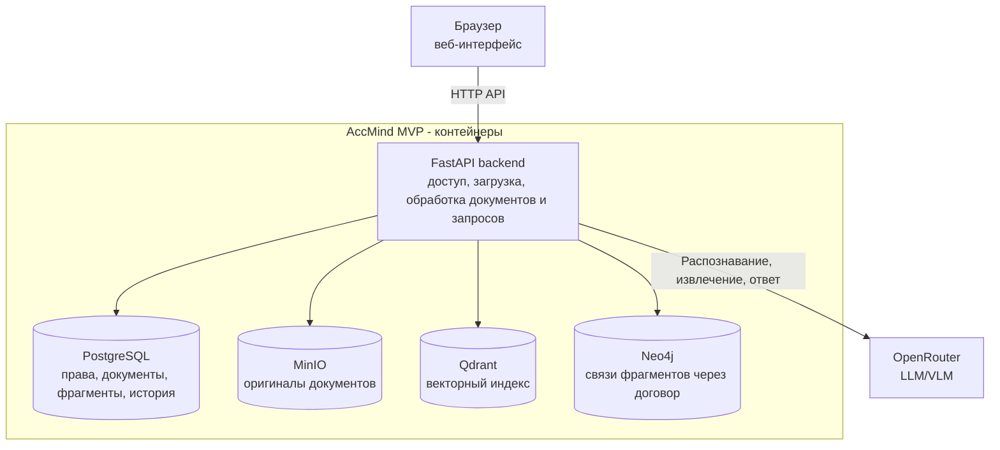

## C4: контейнеры

```mermaid
flowchart TB
    Browser["Браузер<br/>веб-интерфейс"] -->|"HTTP API"| API
    subgraph System["AccMind MVP - контейнеры"]
        API["FastAPI backend<br/>доступ, загрузка, обработка документов и запросов"]
        API --> PG[("PostgreSQL<br/>права, документы, фрагменты, история")]
        API --> MinIO[("MinIO<br/>оригиналы документов")]
        API --> Qdrant[("Qdrant<br/>векторный индекс")]
        API --> Neo4j[("Neo4j<br/>связи фрагментов через договор")]
    end
    API -->|"Распознавание, извлечение, ответ"| Model["OpenRouter<br/>LLM/VLM"]
```
