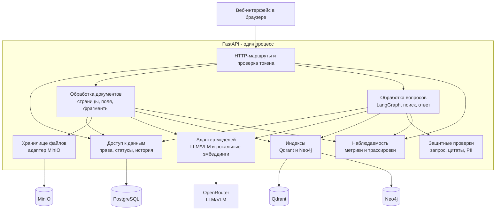

## C4: компоненты API

```mermaid
flowchart TB
    Browser["Веб-интерфейс в браузере"] --> Routes
    subgraph API["FastAPI - один процесс"]
        Routes["HTTP-маршруты и проверка токена"] --> Repo["Доступ к данным<br/>права, статусы, история"]
        Routes --> Upload["Обработка документов<br/>страницы, поля, фрагменты"]
        Routes --> Workflow["Обработка вопросов<br/>LangGraph, поиск, ответ"]
        Routes --> Metrics["Наблюдаемость<br/>метрики и трассировки"]
        Upload --> Repo
        Upload --> Storage["Хранилище файлов<br/>адаптер MinIO"]
        Upload --> Gateway["Адаптер моделей<br/>LLM/VLM и локальные эмбеддинги"]
        Upload --> Index["Индексы<br/>Qdrant и Neo4j"]
        Workflow --> Repo
        Workflow --> Gateway
        Workflow --> Index
        Workflow --> Guardrails["Защитные проверки<br/>запрос, цитаты, PII"]
        Workflow --> Metrics
        Upload --> Metrics
    end
    Repo --> PG[("PostgreSQL")]
    Storage --> MinIO[("MinIO")]
    Index --> Q[("Qdrant")]
    Index --> N[("Neo4j")]
    Gateway --> Models["OpenRouter<br/>LLM/VLM"]
```
