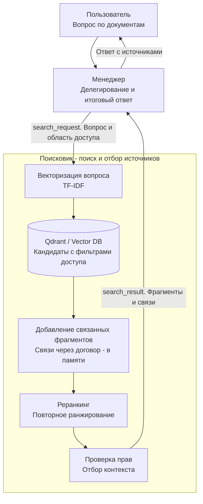

## Взаимодействие агентов

```mermaid
flowchart TB
    U["Пользователь<br/>Вопрос по документам"] --> M["Менеджер<br/>Делегирование и итоговый ответ"]
    M -->|"Ответ с источниками"| U
    subgraph S["Поисковик - поиск и отбор источников"]
        V["Векторизация вопроса<br/>TF-IDF"] --> Q[("Qdrant / Vector DB<br/>Кандидаты с фильтрами доступа")]
        Q --> G["Добавление связанных фрагментов<br/>Связи через договор - в памяти"]
        G --> R["Реранкинг<br/>Повторное ранжирование"]
        R --> C["Проверка прав<br/>Отбор контекста"]
    end
    M -->|"search_request. Вопрос и область доступа"| V
    C -->|"search_result. Фрагменты и связи"| M
```
