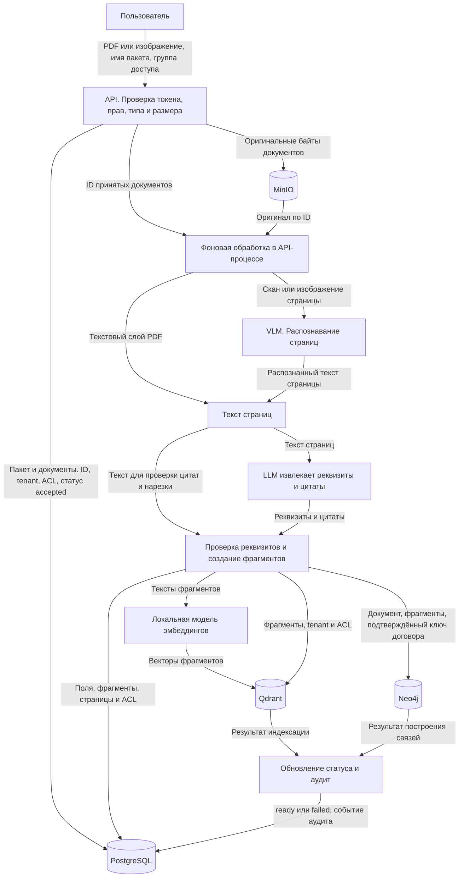

## Data Flow. Загрузка и индексация

```mermaid
flowchart TB
    U["Пользователь"] -->|"PDF или изображение, имя пакета, группа доступа"| A["API. Проверка токена, прав, типа и размера"]
    A -->|"Пакет и документы. ID, tenant, ACL, статус accepted"| PG[("PostgreSQL")]
    A -->|"Оригинальные байты документов"| S3[("MinIO")]
    A -->|"ID принятых документов"| BG["Фоновая обработка в API-процессе"]
    S3 -->|"Оригинал по ID"| BG
    BG -->|"Текстовый слой PDF"| T["Текст страниц"]
    BG -->|"Скан или изображение страницы"| V["VLM. Распознавание страниц"]
    V -->|"Распознанный текст страницы"| T
    T -->|"Текст страниц"| L["LLM извлекает реквизиты и цитаты"]
    T -->|"Текст для проверки цитат и нарезки"| C["Проверка реквизитов и создание фрагментов"]
    L -->|"Реквизиты и цитаты"| C
    C -->|"Поля, фрагменты, страницы и ACL"| PG
    C -->|"Тексты фрагментов"| E["Локальная модель эмбеддингов"]
    E -->|"Векторы фрагментов"| Q[("Qdrant")]
    C -->|"Фрагменты, tenant и ACL"| Q
    C -->|"Документ, фрагменты, подтверждённый ключ договора"| N[("Neo4j")]
    Q -->|"Результат индексации"| R["Обновление статуса и аудит"]
    N -->|"Результат построения связей"| R
    R -->|"ready или failed, событие аудита"| PG
```
