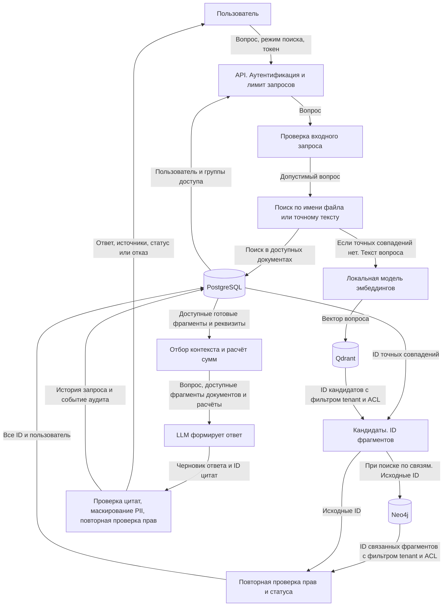

## Data Flow. Поиск и ответ

```mermaid
flowchart TB
    U["Пользователь"] -->|"Вопрос, режим поиска, токен"| A["API. Аутентификация и лимит запросов"]
    PG[("PostgreSQL")] -->|"Пользователь и группы доступа"| A
    A -->|"Вопрос"| G["Проверка входного запроса"]
    G -->|"Допустимый вопрос"| F["Поиск по имени файла или точному тексту"]
    F -->|"Поиск в доступных документах"| PG
    PG -->|"ID точных совпадений"| IDs["Кандидаты. ID фрагментов"]
    F -->|"Если точных совпадений нет. Текст вопроса"| E["Локальная модель эмбеддингов"]
    E -->|"Вектор вопроса"| Q[("Qdrant")]
    Q -->|"ID кандидатов с фильтром tenant и ACL"| IDs
    IDs -->|"При поиске по связям. Исходные ID"| N[("Neo4j")]
    N -->|"ID связанных фрагментов с фильтром tenant и ACL"| V["Повторная проверка прав и статуса"]
    IDs -->|"Исходные ID"| V
    V -->|"Все ID и пользователь"| PG
    PG -->|"Доступные готовые фрагменты и реквизиты"| K["Отбор контекста и расчёт сумм"]
    K -->|"Вопрос, доступные фрагменты документов и расчёты"| L["LLM формирует ответ"]
    L -->|"Черновик ответа и ID цитат"| O["Проверка цитат, маскирование PII, повторная проверка прав"]
    O -->|"Ответ, источники, статус или отказ"| U
    O -->|"История запроса и событие аудита"| PG
```
