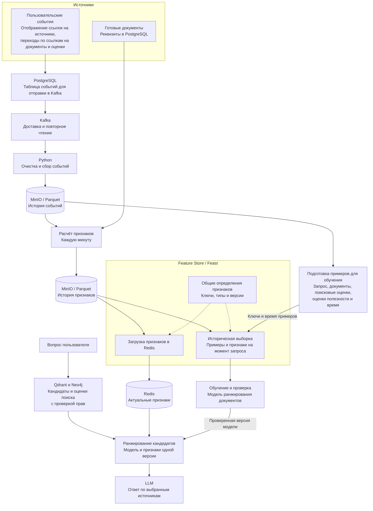

## Обучение и использование признаков

```mermaid
flowchart TB
    subgraph IN["Источники"]
        D["Готовые документы<br/>Реквизиты в PostgreSQL"]
        E["Пользовательские события<br/>Отображение ссылок на источники,<br/>переходы по ссылкам на документы и оценки"]
    end
    E --> W["PostgreSQL<br/>Таблица событий для отправки в Kafka"]
    W --> K["Kafka<br/>Доставка и повторное чтение"]
    K --> A["Python<br/>Очистка и сбор событий"]
    A --> H[("MinIO / Parquet<br/>История событий")]
    H --> F["Расчёт признаков<br/>Каждую минуту"]
    D --> F
    F --> O[("MinIO / Parquet<br/>История признаков")]
    subgraph FS["Feature Store / Feast"]
        FV["Общие определения признаков<br/>Ключи, типы и версии"]
        T["Историческая выборка<br/>Примеры и признаки на момент запроса"]
        M["Загрузка признаков в Redis"]
    end
    O --> T
    O --> M
    FV -.-> T
    FV -.-> M
    H --> B["Подготовка примеров для обучения<br/>Запрос, документы, поисковые оценки,<br/>оценки полезности и время"]
    B -->|"Ключи и время примеров"| T
    T --> TR["Обучение и проверка<br/>Модель ранжирования документов"]
    M --> R[("Redis<br/>Актуальные признаки")]
    U["Вопрос пользователя"] --> Q["Qdrant и Neo4j<br/>Кандидаты и оценки поиска<br/>с проверкой прав"]
    Q --> S["Ранжирование кандидатов<br/>Модель и признаки одной версии"]
    R --> S
    TR -->|"Проверенная версия модели"| S
    S --> L["LLM<br/>Ответ по выбранным источникам"]
```
