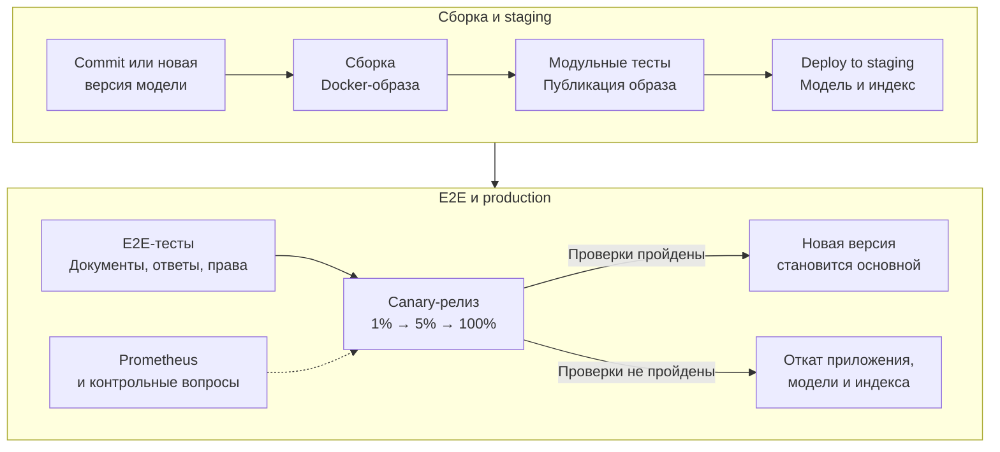

```mermaid
flowchart TB
    subgraph PREP["Сборка и staging"]
        direction LR
        START["Commit или новая<br/>версия модели"] --> BUILD["Сборка<br/>Docker-образа"]
        BUILD --> UNIT["Модульные тесты<br/>Публикация образа"]
        UNIT --> STAGE["Deploy to staging<br/>Модель и индекс"]
    end

    subgraph RELEASE["E2E и production"]
        direction LR
        E2E["E2E-тесты<br/>Документы, ответы, права"] --> CANARY["Canary-релиз<br/>1% → 5% → 100%"]
        CANARY -->|"Проверки пройдены"| PROD["Новая версия<br/>становится основной"]
        METRICS["Prometheus<br/>и контрольные вопросы"] -.-> CANARY
        CANARY -->|"Проверки не пройдены"| BACK["Откат приложения,<br/>модели и индекса"]
    end

    PREP --> RELEASE
```
