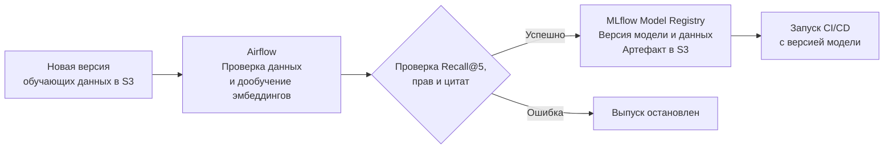

```mermaid
flowchart LR
    DATA["Новая версия<br/>обучающих данных в S3"] --> TRAIN["Airflow<br/>Проверка данных<br/>и дообучение эмбеддингов"]
    TRAIN --> QUALITY{"Проверка Recall@5,<br/>прав и цитат"}
    QUALITY -->|"Успешно"| REG["MLflow Model Registry<br/>Версия модели и данных<br/>Артефакт в S3"]
    REG --> TRIGGER["Запуск CI/CD<br/>с версией модели"]
    QUALITY -->|"Ошибка"| STOP["Выпуск остановлен"]
```
